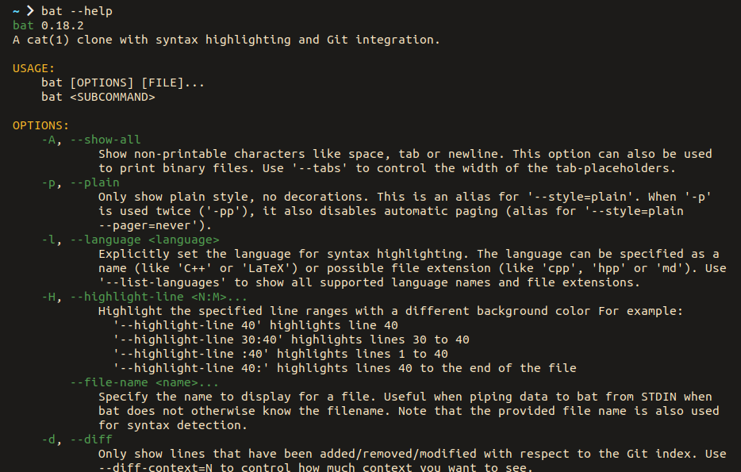

# cmd-help.sublime-syntax :construction:

This is a Sublime Syntax definition for [bat](https://github.com/sharkdp/bat) to color command `--help` messages.

Its goal is generalizing the useful coloring in help messages generated with [clap-rs](https://github.com/clap-rs/clap). For instance:

So we want minimal coloring, only for sections and definitions, just enough to help find your way around a help message.

You can see how it currently does in [`tests/highlighted/`](./tests/highlighted/). Just make sure to parse the files with `cat` or `less -R`.

For installation, refer to [bat's documentation on adding new syntaxes](https://github.com/sharkdp/bat#adding-new-syntaxes--language-definitions).

## License

MIT © Víctor González Prieto
