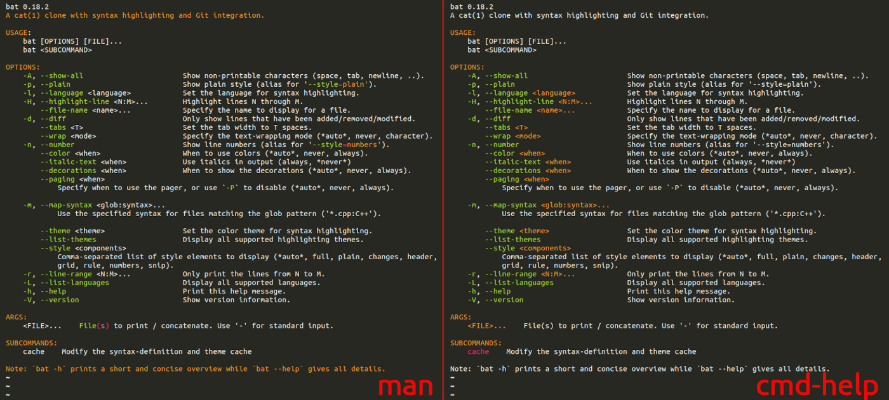

# cmd-help.sublime-syntax :construction:

This is a Sublime Syntax definition for [bat](https://github.com/sharkdp/bat) to colorize command `--help` messages.

It provides just enough color to help find your way around a help message. Here's how it compares to the [currently recommended](https://github.com/sharkdp/bat/issues/1430) man syntax:

## Install

To use this with `bat`, copy the `syntaxes/cmd-help.sublime-syntax` file into `~/.config/bat/syntaxes/`.

Then run `$ bat cache --build`.

Now you can use this with `$ SOME_COMMAND --help | bat -pl cmd-help`.

You can also use a shell function to streamline that, see an example [here](./docs/bathelp.sh).

## License

MIT © Víctor González Prieto
