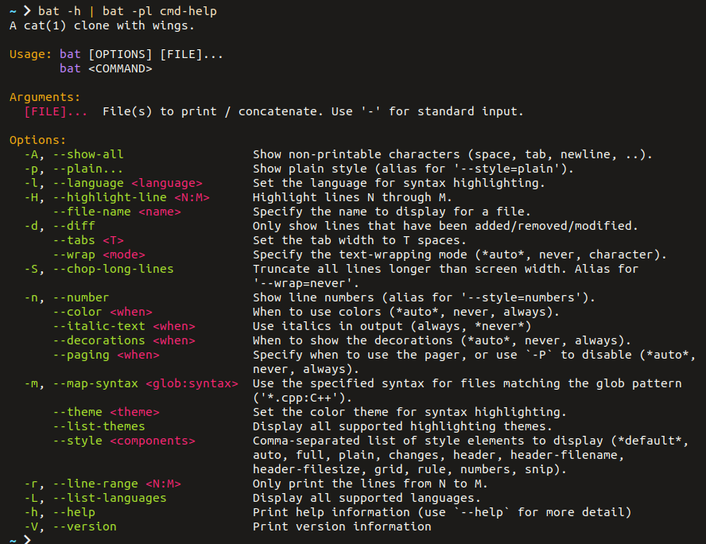

# cmd-help.sublime-syntax

Sublime Syntax definition for [`bat`](https://github.com/sharkdp/bat) to colorize command `--help` messages.

It provides just enough color to help find your way around a help message.

[See examples from other help messages.](https://github.com/victor-gp/cmd-help-sublime-syntax/tree/demo/examples)

## Installation

This syntax is included with `bat` since version 0.21.0.

If you have an earlier version of `bat` or you want the latest version of `cmd-help`, you can [add it as a new syntax](https://github.com/sharkdp/bat#adding-new-syntaxes--language-definitions). You have to copy [this syntax file](./syntaxes/cmd-help.sublime-syntax).

To check that everything works, run `git --help | bat -plhelp`

## Configuration

**[Visit the wiki for configuration tips](https://github.com/victor-gp/cmd-help-sublime-syntax/wiki/Configuration-tips)**, including:

- Setting a `bathelp` alias to avoid typing the full `bat` command with options each time (basic configuration).
- Adding a `help` function you can use like `$ help <CMD>`, or even `$ help <CMD> <SUBCMD>`.
- Enhancing `--help` so you can simply type `$ <CMD> --help` as usual.

`cmd-help` is compatible with most `bat` themes (\~2/3rds). To get the best experience, ensure your configured theme is supported. [See the list of compatible themes](https://github.com/victor-gp/cmd-help-sublime-syntax/wiki/Bat-theme-support).

## Contributing

Contributions are welcome! :D

Make sure to give [CONTRIBUTING.md](./CONTRIBUTING.md) a cursory read to learn how you can help.

If you want to hack on the project, look at [the Development doc](./docs/Development.md) to help get you started.

If you like `cmd-help`, please [star it on GitHub](https://github.com/victor-gp/cmd-help-sublime-syntax) and spread the word. :)

## License

MIT © Víctor González Prieto
